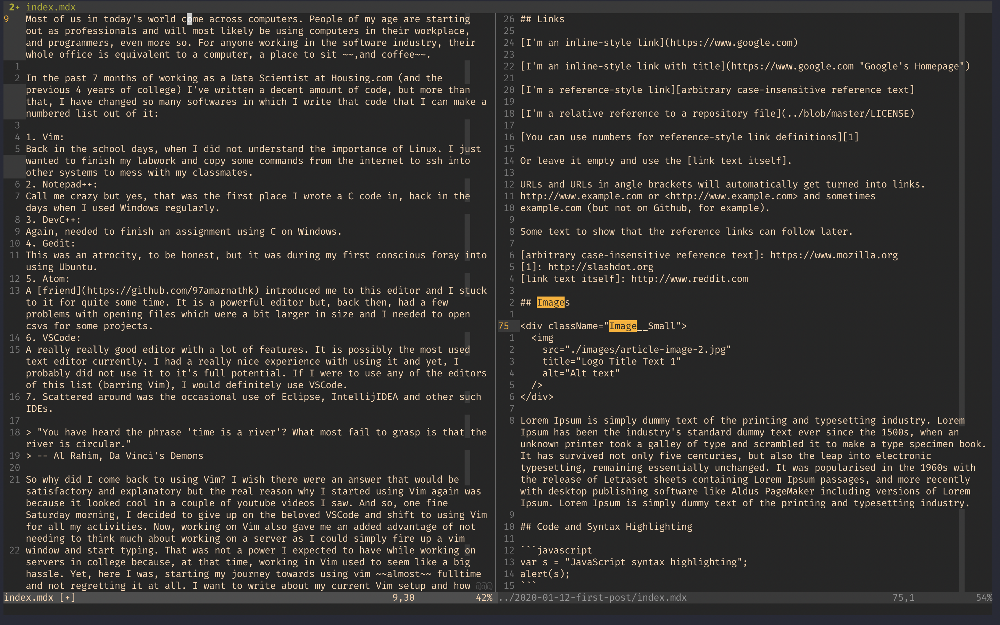

Most of us in today's world come across computers. People of my age are starting out as professionals and will most likely be using computers in their workplace, and programmers, even more so. For anyone working in the software industry, their whole office is equivalent to a computer, a place to sit ~~,and coffee~~.

In the past 7 months of working as a Data Scientist at Housing.com (and the previous 4 years of college) I've written a decent amount of code, but more than that, I have changed so many softwares in which I write that code that I can make a numbered list out of it:

1. **Vim**: A long time ago, in the school days, when I did not understand the importance of Linux. I just wanted to finish my labwork and copy some commands from the internet to ssh into other systems to mess with my classmates.

2. **Notepad++**: Call me crazy but yes, that was the first place I wrote a C code in, back in the days when I used Windows regularly.

3. **DevC++**: Again, needed to finish an assignment using C on Windows.

4. **Gedit**: This was an atrocity, to be honest, but it was during my first conscious foray into using Ubuntu.

5. **Atom**: A [friend](https://github.com/97amarnathk) introduced me to this editor and I stuck to it for quite some time. It is a powerful editor but, back then, had a few problems with opening files which were a bit larger in size and I needed to open csvs for some projects.

6. **VSCode**: A really really good editor with a lot of features. It is possibly the most used text editor currently. I had a really nice experience with using it and yet, I probably did not use it to it's full potential. If I were to use any of the editors of this list (barring Vim), I would definitely use VSCode.

7. Scattered around was the occasional use of Eclipse, IntellijIDEA and other such IDEs.

> "You have heard the phrase 'time is a river'? What most fail to grasp is that the river is circular."
> -- Al Rahim, Da Vinci's Demons

So why did I come back to using Vim? I wish there were an answer that would be satisfactory and explanatory but the real reason why I started using Vim again was because it looked cool in a couple of youtube videos I saw. And so, one fine Saturday morning, I decided to give up on the beloved VSCode and shift to using Vim for all my activities. Now, working on Vim also gave me an added advantage of not needing to think much about working on a server as I could simply fire up a vim
window and start typing. That was not a power I expected to have while working on servers in college because, at that time, working in Vim used to seem like a big hassle. Yet, here I was, starting my journey towards using vim ~~almost~~ fulltime and not regretting it at all. I want to write about my current Vim setup and how I use it in my everyday work but I think I'll keep it for the next post ~~because we need more posts on this blog~~. Till then, as the title says, It all started on a wh(v)im...

  

